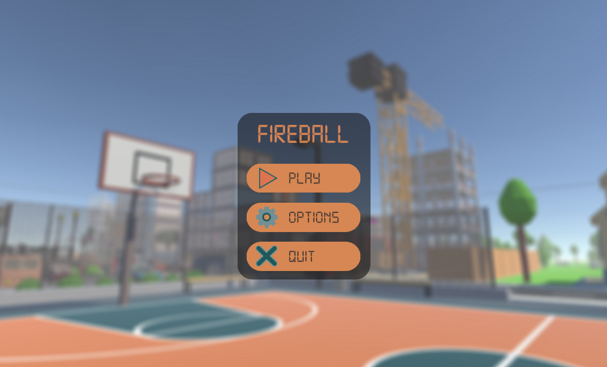
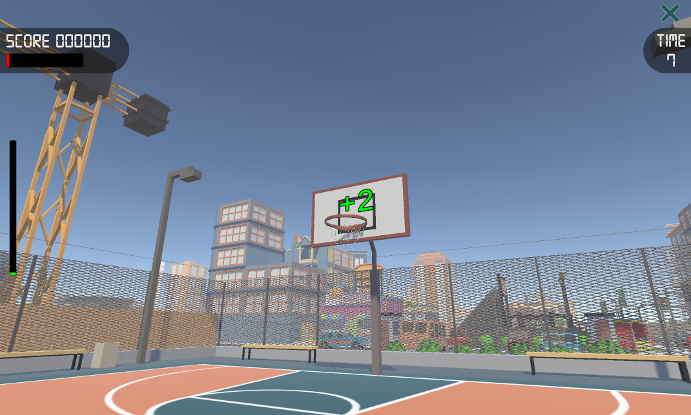
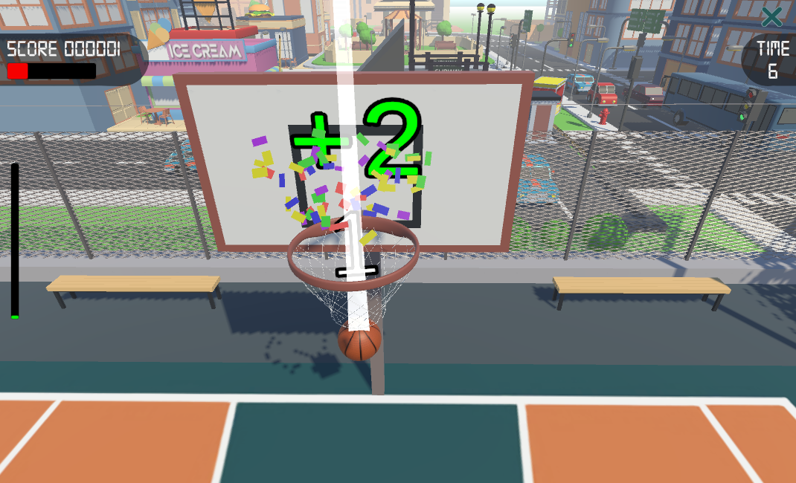
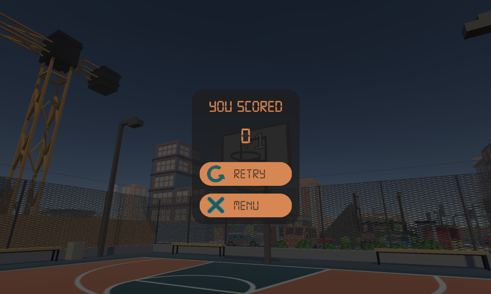
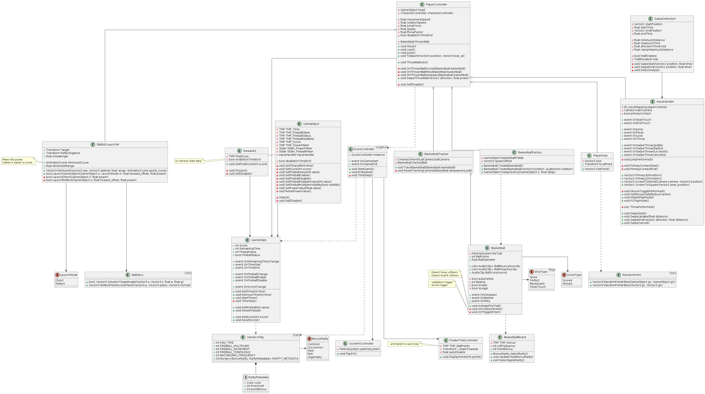

# grzegorz.mikulski.basket-challenge

This project creates a simple basketball throwing game by swiping in unity with PC and Mobile support.

  
  

  
  

# Description
## Main Menu  
The main menu offers simple options to: play the game, open the settings which allows to change the game duration and exit the application.

## Gameplay  
Users can throw a ball with the power they deem right to score by dragging the mouse (or finger) on the screen, swiping up will go for a direct shot, while angled swipes (ca. 45deg) left or right will go for backboard shots, i.e. the ball will hit the backboard before going in the basket. Should the throw force be wrong the basket will likely not be scored.

Whenever a basket is scored and the ball is removed, the player will teleport to a new location on the court for a new shot.

Should a basket not be scored the player will have to shoot again from the same position.

The game defaults to Mobile controls, swipes (2 seconds max) to throw the ball, but it can support some form of PC controls though it's still not clearly defined: (\\) can be used to toggle the mouse; when it is not active the mouse will move the player view and (WASD) will move the player position, (LMB) will perform an optimal direct shot to the basket and (Space) will make the player jump.

## Fireball
An additional game mechanic was implemented where if a player consecutively scores an amount of baskets, double points are obtained until a basket is missed

# Software
- [Unity](https://unity.com/releases/editor/archive) 2022.3.62f1
- Visual Studio 2022

# Assets
- [Toon City Pack](https://assetstore.unity.com/packages/3d/environments/urban/toon-city-pack-234785) - Punk Games, Oct 26 2022
- [Digital-7 Font](https://www.fontspace.com/digital-7-font-f7087) - Style-7, Oct 31 2022
- [Basketball Court](https://sketchfab.com/3d-models/basketball-court-d2ea5bc76e094f1a9e6aa15891bd6885) - Klieg3D, Aug 30 2020

# Audio
- [Basketball Hit](https://mixkit.co/free-sound-effects/basketball/) - Mixkit
- [Basketball Hoop](https://pixabay.com/sound-effects/film-special-effects-basketball-85872/) - reedhos, Pixabay, Aug 15 2022
- [City Ambience](https://pixabay.com/sound-effects/city-city-above-far-ambience-car-479129/) - CliffordJohnson, Pixabay Feb 5 2026

# Installation
1. Download Unity 2022.3.62f1
2. Clone the repo
3. Add the downloaded repo folder from Unity Hub
4. [OPTIONAL] Download the Toon City Pack for scenery, add it to the project assets: ./Assets/ThirdParty/
5. Open SCN_MainMenu or SCN_Gameplay located in ./Scenes/

# Notes
UML diagrams done with PlantUML with any compatible editor, e.g. [Pladitor](https://plantumleditor.com/)

Since throwing a ball with the exact velocity to score a basket is challenging, an aim assist was introduced using where the shot would have landed and pulling it towards an optimal point. It can be tested in a Desmos snapshot [here](https://www.desmos.com/calculator/ghqp4ncgbu)

# UML

